# Software Architecture Diagrams Specification

## Prometheus Analytics Platform (pAP)

### Prometheus Analytics Platform

---

# Document Information

| Field         | Value                                                     |
| ------------- | --------------------------------------------------------- |
| Project       | Prometheus Analytics Platform             |
| Document Type | Software Architecture Diagrams                            |
| Version       | 1.0                                                       |
| Status        | Approved                                                  |
| Notation      | UML 2.5, C4 Model, Mermaid                                |
| Audience      | Architects, Developers, Analytics Engineers, Stakeholders |

---

# 1. Purpose

This document contains the architectural diagrams required to understand, develop, deploy, maintain, and scale the Engineering Infrastructure Analytics Platform.

The diagrams follow:

* UML 2.5
* C4 Model
* Enterprise Architecture Practices
* Microservice-ready Design
* Cloud Native Principles

---

# 2. System Context Diagram (C4 Level 1)

## Objective

Show the platform and external systems.

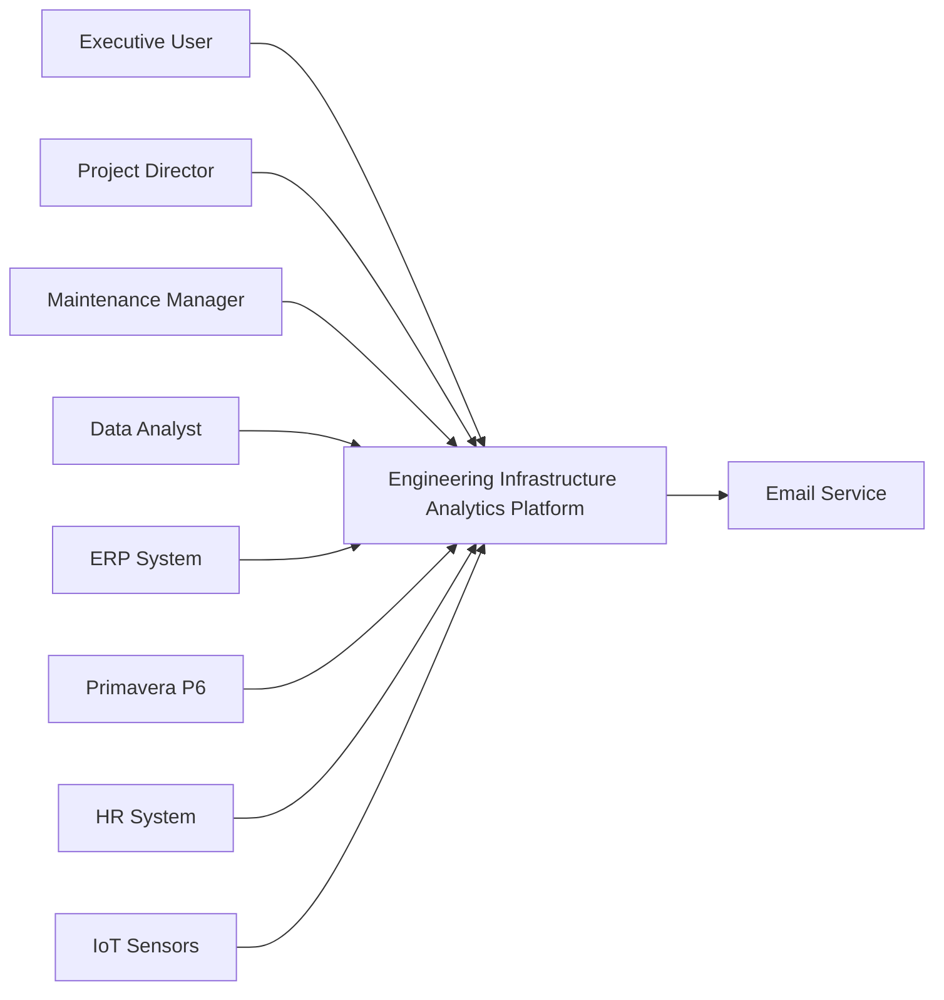

---

# 3. Container Diagram (C4 Level 2)

## Objective

Show major containers.

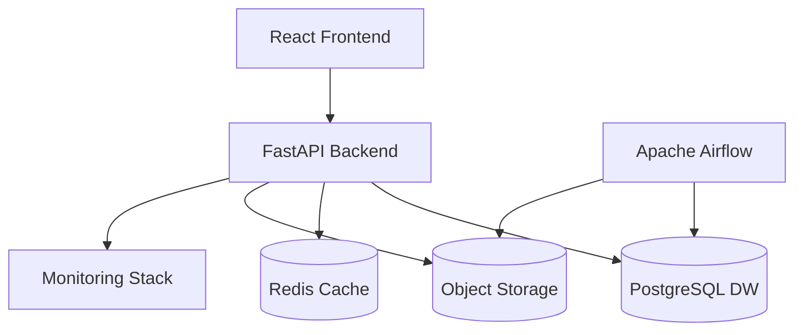

---

# 4. Component Diagram

## Backend Components

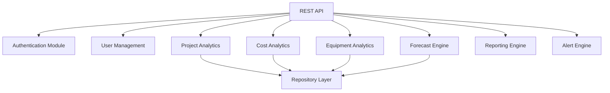

---

# 5. Layered Architecture Diagram

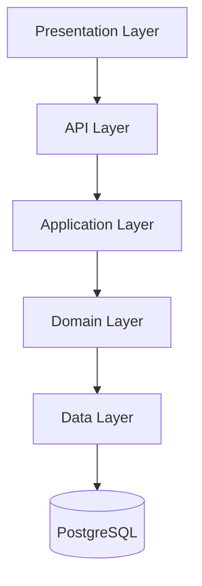

---

# 6. Domain Driven Design Diagram

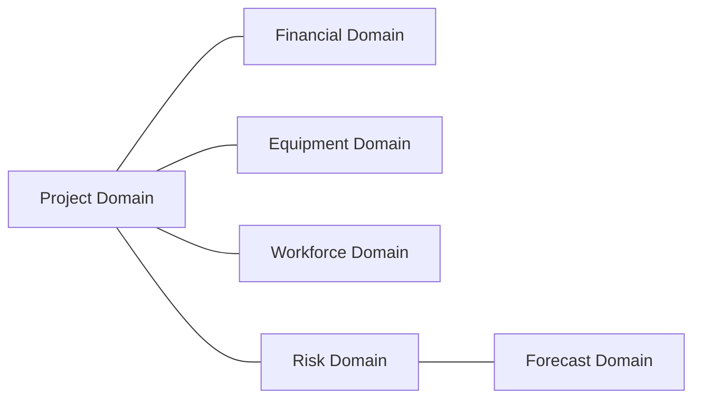

---

# 7. Deployment Diagram

## Development Environment

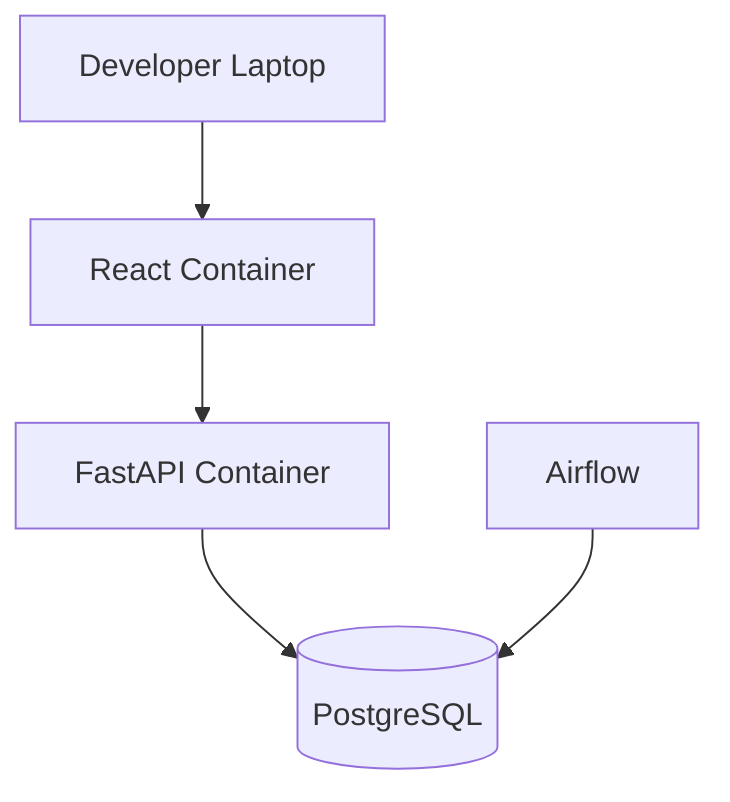

---

## Production Environment

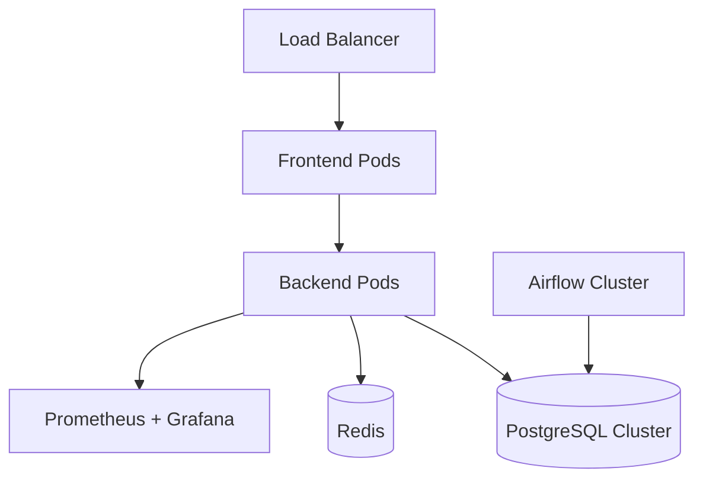

---

# 8. Data Flow Diagram

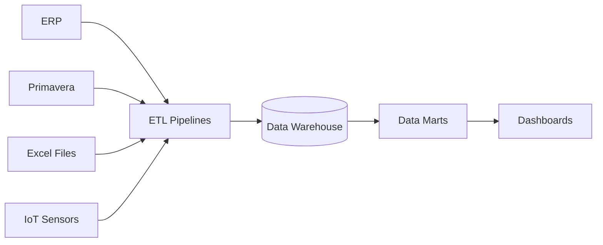

---

# 9. ETL Process Diagram

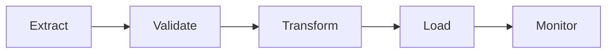

---

# 10. Data Warehouse Architecture Diagram

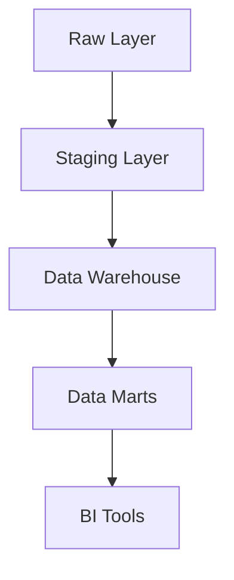

---

# 11. Star Schema Diagram

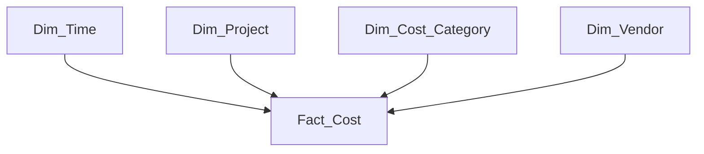

---

# 12. Authentication Sequence Diagram

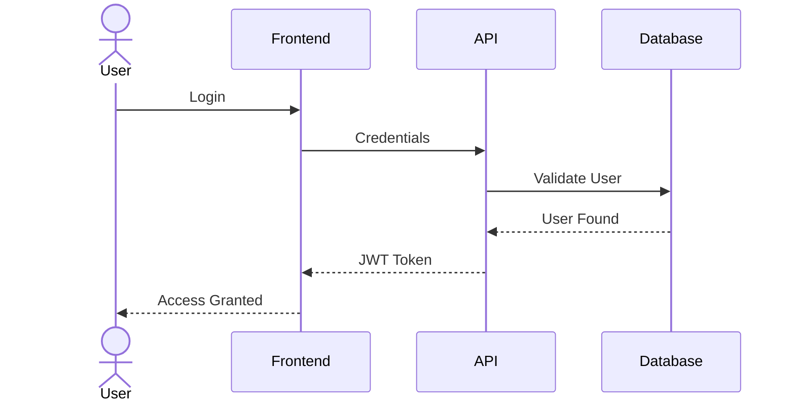

---

# 13. Forecast Execution Sequence Diagram

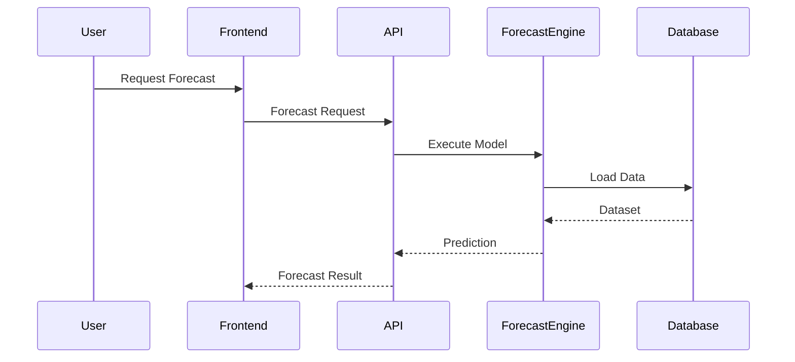

---

# 14. Alert Generation Sequence Diagram

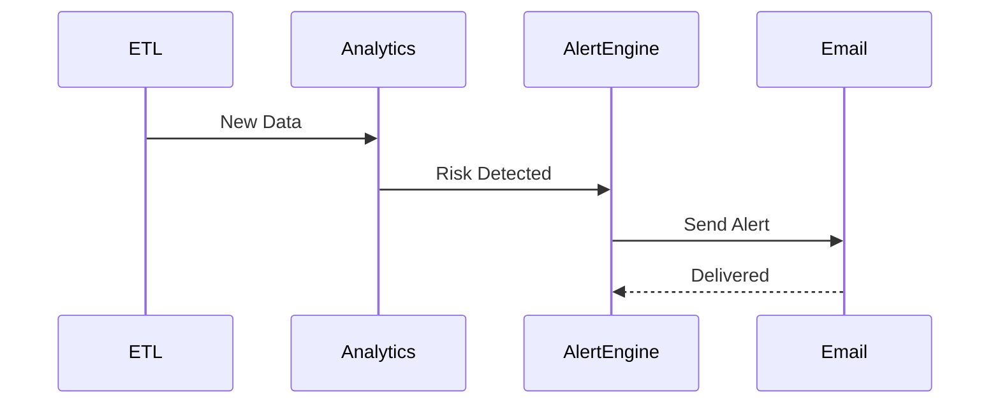

---

# 15. State Machine Diagram

## Project Lifecycle

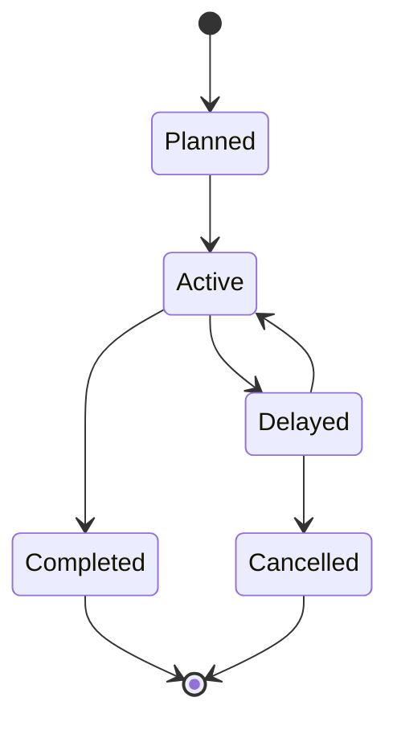

---

# 16. Equipment State Machine

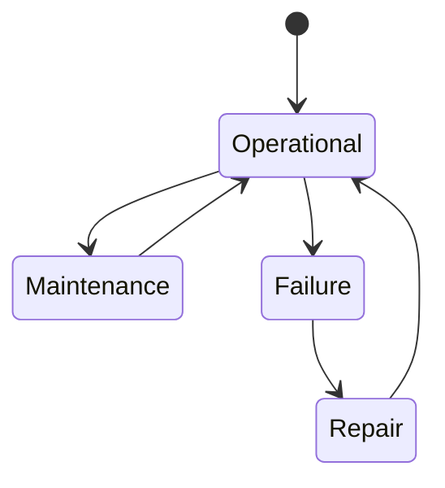

---

# 17. Future Microservice Extraction Diagram

## Evolution Roadmap

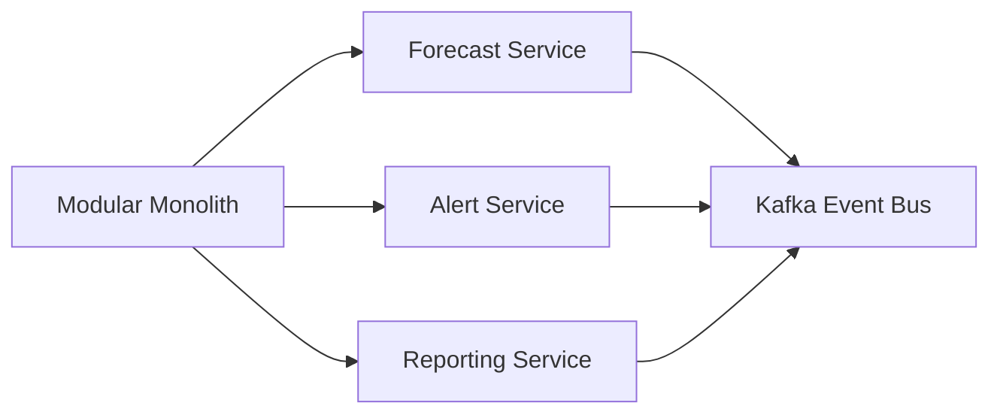

---

# 18. Event Driven Architecture Diagram

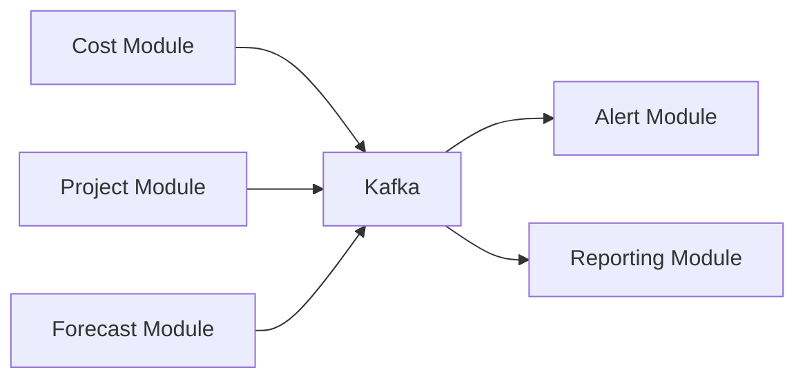

---

# 19. Monitoring Architecture Diagram

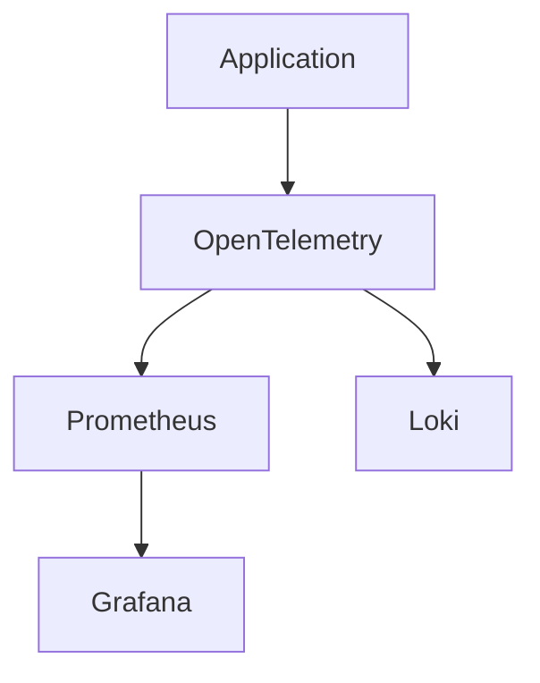

---

# 20. Infrastructure Roadmap

## Phase 1

```text
Docker Compose
React
FastAPI
PostgreSQL
Airflow
```

## Phase 2

```text
Redis
Object Storage
Grafana
Prometheus
```

## Phase 3

```text
Kafka
Forecast Service
Alert Service
```

## Phase 4

```text
Kubernetes
Service Mesh
Autoscaling
```

## Phase 5

```text
Digital Twin
IoT Streaming
AI Copilot
```

---

# 21. Architecture Validation Checklist

| Requirement                | Covered |
| -------------------------- | ------- |
| Scalability                | Yes     |
| Modularity                 | Yes     |
| Cloud Ready                | Yes     |
| Docker Ready               | Yes     |
| Kubernetes Ready           | Yes     |
| Event Driven Ready         | Yes     |
| Data Warehouse Ready       | Yes     |
| MLOps Ready                | Yes     |
| Analytics Ready            | Yes     |
| Future Microservices Ready | Yes     |

---
