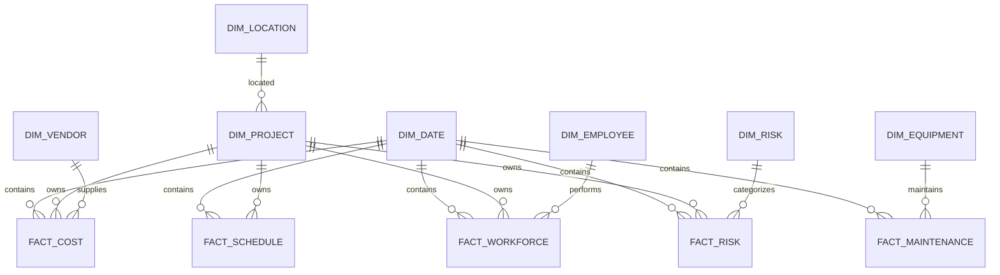

# Logical Data Model
## Prometheus Analytics Platform

**Version:** 2.0  
**Status:** Approved for Physical Modeling  
**Author:** Luz Villanueva

---

# 1. Purpose

This document defines the Logical Data Model (LDM) for the Prometheus Analytics Platform.

The model follows a modern Analytics Engineering architecture based on:

- Medallion Architecture
- Data Warehouse Modeling
- Star Schema Design
- DataOps Principles
- Analytics Engineering Best Practices

The objective is to support:

- Project Management Analytics
- Construction Analytics
- Financial Analytics
- Equipment Analytics
- Workforce Analytics
- Risk Analytics
- Predictive Analytics
- Executive Dashboards
- Machine Learning Models
- AI Copilot Integration

---

# 2. Data Architecture Layers

The platform is divided into three analytical layers.

```text
SOURCE SYSTEMS
      │
      ▼
┌─────────────┐
│ RAW LAYER   │
└─────────────┘
      │
      ▼
┌─────────────┐
│ TRUSTED     │
│ LAYER       │
└─────────────┘
      │
      ▼
┌─────────────┐
│ CURATED     │
│ LAYER       │
└─────────────┘
      │
      ▼
Business Intelligence
Machine Learning
Executive Dashboards
AI Copilot
```

---

# 3. Source Systems

## Internal Sources

| Source | Description |
|----------|-------------|
| ERP | Financial transactions |
| Procurement System | Purchase orders |
| Maintenance System | Equipment maintenance |
| HR System | Employee information |
| Project Management | Primavera P6 / MS Project |
| Safety System | Incidents and safety events |

## External Sources

| Source | Description |
|----------|-------------|
| Weather APIs | Climate conditions |
| Market APIs | Material prices |
| Geospatial Data | Project locations |

---

# 4. RAW Layer

Schema:

```sql
raw
```

Purpose:

Store source data exactly as received.

No business transformations are applied.

---

## RAW Entities

### raw_projects

| Attribute |
|------------|
| project_id |
| project_name |
| project_type |
| location |
| start_date |
| end_date |

---

### raw_costs

| Attribute |
|------------|
| project_id |
| vendor_id |
| cost_date |
| planned_cost |
| actual_cost |

---

### raw_schedule

| Attribute |
|------------|
| project_id |
| report_date |
| planned_progress |
| actual_progress |

---

### raw_equipment

| Attribute |
|------------|
| equipment_id |
| equipment_name |
| equipment_type |
| manufacturer |

---

### raw_maintenance

| Attribute |
|------------|
| equipment_id |
| maintenance_date |
| downtime_hours |
| maintenance_cost |

---

### raw_employees

| Attribute |
|------------|
| employee_id |
| employee_name |
| department |
| role |

---

### raw_risks

| Attribute |
|------------|
| risk_id |
| project_id |
| probability |
| severity |
| impact_cost |
| impact_days |

---

# 5. TRUSTED Layer

Schema:

```sql
trusted
```

Purpose:

Provide cleansed and validated enterprise data.

Transformations:

- Standardization
- Deduplication
- Data Validation
- Data Quality Checks
- Business Rules

---

# Trusted Entities

## trusted_project

| Attribute |
|------------|
| project_id |
| project_name |
| project_type |
| location |
| start_date |
| planned_end_date |
| status |

---

## trusted_equipment

| Attribute |
|------------|
| equipment_id |
| equipment_name |
| equipment_type |
| manufacturer |
| purchase_date |
| status |

---

## trusted_employee

| Attribute |
|------------|
| employee_id |
| full_name |
| role |
| department |
| hire_date |

---

## trusted_vendor

| Attribute |
|------------|
| vendor_id |
| vendor_name |
| category |
| country |

---

## trusted_location

| Attribute |
|------------|
| location_id |
| country |
| region |
| city |
| site_name |

---

## trusted_risk

| Attribute |
|------------|
| risk_id |
| risk_name |
| risk_category |
| risk_description |

---

## trusted_cost

| Attribute |
|------------|
| project_id |
| vendor_id |
| cost_date |
| planned_cost |
| actual_cost |

---

## trusted_schedule

| Attribute |
|------------|
| project_id |
| report_date |
| planned_progress |
| actual_progress |

---

## trusted_maintenance

| Attribute |
|------------|
| equipment_id |
| maintenance_date |
| maintenance_type |
| downtime_hours |
| maintenance_cost |

---

# 6. CURATED Layer

Schema:

```sql
curated
```

Purpose:

Provide optimized analytical structures for reporting and machine learning.

The Curated Layer follows Star Schema principles.

---

# 7. Dimensions

## dim_date

### Grain

One record per calendar day.

| Attribute |
|------------|
| date_key |
| full_date |
| year |
| quarter |
| month |
| month_name |
| week |
| day |
| day_name |

---

## dim_project

### Grain

One record per project.

| Attribute |
|------------|
| project_key |
| project_id |
| project_name |
| project_type |
| location_key |
| start_date |
| planned_end_date |
| status |

---

## dim_equipment

### Grain

One record per equipment.

| Attribute |
|------------|
| equipment_key |
| equipment_id |
| equipment_name |
| equipment_type |
| manufacturer |
| purchase_date |
| status |

---

## dim_employee

### Grain

One record per employee.

| Attribute |
|------------|
| employee_key |
| employee_id |
| full_name |
| role |
| department |
| hire_date |

---

## dim_vendor

### Grain

One record per vendor.

| Attribute |
|------------|
| vendor_key |
| vendor_id |
| vendor_name |
| category |
| country |

---

## dim_location

### Grain

One record per location.

| Attribute |
|------------|
| location_key |
| country |
| region |
| city |
| site_name |

---

## dim_risk

### Grain

One record per risk category.

| Attribute |
|------------|
| risk_key |
| risk_id |
| risk_name |
| risk_category |
| risk_description |

---

# 8. Fact Tables

## fact_cost

### Grain

One project cost record per day.

| Attribute |
|------------|
| cost_key |
| date_key |
| project_key |
| vendor_key |
| planned_cost |
| actual_cost |
| forecast_cost |

Measures:

- Planned Cost
- Actual Cost
- Forecast Cost
- Cost Variance

---

## fact_schedule

### Grain

One project schedule record per reporting date.

| Attribute |
|------------|
| schedule_key |
| date_key |
| project_key |
| planned_progress |
| actual_progress |
| spi |

Measures:

- Planned Progress
- Actual Progress
- SPI

---

## fact_maintenance

### Grain

One maintenance event.

| Attribute |
|------------|
| maintenance_key |
| date_key |
| equipment_key |
| maintenance_type |
| downtime_hours |
| maintenance_cost |

Measures:

- Downtime Hours
- Maintenance Cost
- MTBF
- MTTR

---

## fact_workforce

### Grain

One employee work record per day.

| Attribute |
|------------|
| workforce_key |
| date_key |
| employee_key |
| project_key |
| hours_worked |
| productivity_score |

Measures:

- Hours Worked
- Productivity
- Utilization

---

## fact_risk

### Grain

One risk event per project occurrence.

| Attribute |
|------------|
| risk_event_key |
| date_key |
| project_key |
| risk_key |
| probability |
| severity_score |
| impact_cost |
| impact_days |
| risk_score |

Measures:

- Probability
- Severity
- Cost Impact
- Schedule Impact
- Risk Exposure Score

---

# 9. Curated Star Schema

```text
                              dim_date
                                  │
 ┌───────────────┬───────────────┬───────────────┬───────────────┬───────────────┐
 │               │               │               │               │
 ▼               ▼               ▼               ▼               ▼

fact_cost   fact_schedule  fact_maintenance  fact_workforce  fact_risk

 │               │               │               │               │
 │               │               │               │               │

 ▼               ▼               ▼               ▼               ▼

dim_project  dim_project   dim_equipment   dim_employee    dim_risk
      │
      │
      ▼

dim_vendor

      │
      │
      ▼

dim_location
```

---

# 10. Logical Relationships



---

# 11. Analytical Outputs Supported

The model supports:

- Cost Performance Index (CPI)
- Schedule Performance Index (SPI)
- Cost Variance (CV)
- Schedule Variance (SV)
- Earned Value Management (EVM)
- Equipment Utilization
- MTBF
- MTTR
- Workforce Productivity
- Risk Exposure Analysis
- Cost Forecasting
- Delay Prediction
- Predictive Maintenance
- Executive Dashboards
- AI Copilot Recommendations

---

# 12. Future Extensions

Future Dimensions:

- dim_contract
- dim_material
- dim_weather
- dim_customer
- dim_sensor

Future Facts:

- fact_quality
- fact_safety
- fact_environment
- fact_iot_sensor
- fact_energy_consumption

---

# End of Document